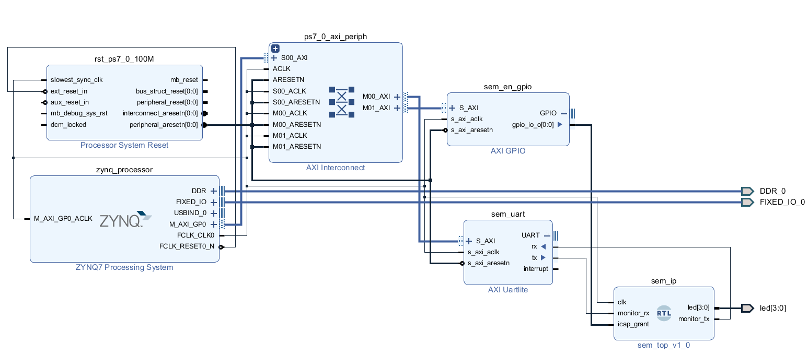
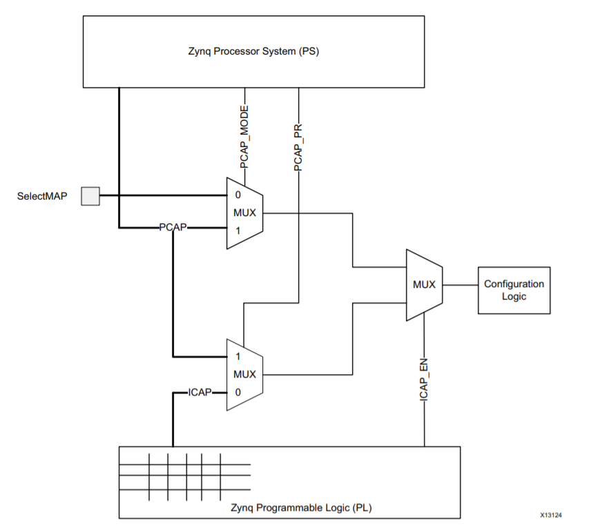

# SEM-IP-PYNQ
This repo contains a basic test for SEM (Soft Error Mitigation) IP for PYNQ. 

## Structure

	bits : Bitstream folder
	img : Image folder
	prj : Vivado project tcl
	src : Source folder (AXI uartlite class)

## Block Diagram

Here we can see the diagram for this bitstream. It consists in: AXI GPIO, AXI Uartlite and SEM IP.

### SEM_IP

1. The sem_ip module can communicate with the ZYNQ using the AXI Uartlite block.
2. The status bits are showed in PYNQ-Z2 board leds.
   * led[0] = SEM Injection status
   * led[1] = SEM Initialization status
   * led[2] = SEM ICAP Enable
   
### AXI_GPIO

Controls the ICAP_GRANT signal from SEM_IP. If I put a logic 1. SEM_IP will start.

### AXI_UARTLITE

Controls the communication between SEM_IP and PS.

## ICAP and PCAP (Xilinx application note PG036, Page 57)

During boot of the Zynq-7000 Processing System (PS), access to the configuration logic in the device is given to the PS through the processor configuration access port (PCAP). This provides a path for the PS bootloader to download a bitstream to the Zynq-7000 Programmable Logic (PL). When the PS bootloader completes, the PS and PCAP remain in control of the configuration logic to support partial reconfiguration of the PL by the PS. 

However, while the PS and PCAP are in control of the configuration logic, the PL and ICAP are locked out of the configuration logic. In order for the controller to function, configuration logic access must be transferred to the ICAP. This is accomplished by clearing PCAP_PR (bit 27) in the PS device configuration control register (DEVCFG CTRL, address 0xF8007000).

